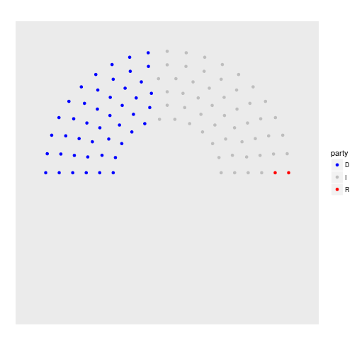
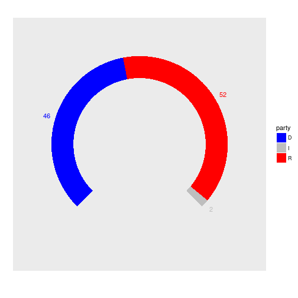
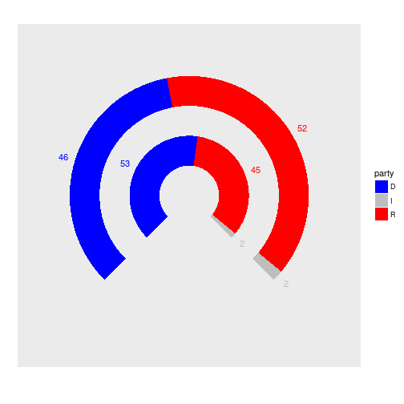
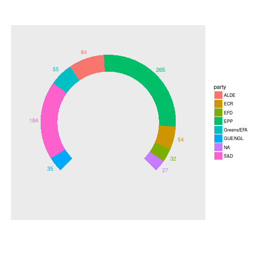
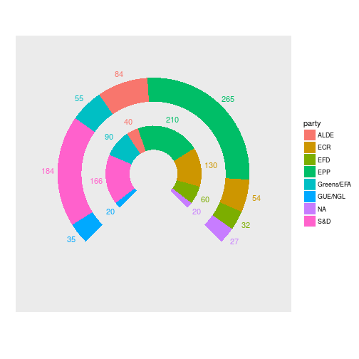

# Parliament plots

This package attempts to implement "parliament plots" - visual representations of the composition of legislatures that display seats color-coded by party. The input is a data frame containing one row per party, with columns representing party name/label and number of seats, respectively.

## Code Examples

Here are some examples for a "small" parliament:


```r
library("ggplot2")
library("ggparliament")

# example data (114th vs 115th US Senate)
d <- data.frame(Party = c("D", "R", "I"),
                Number = c(46, 52, 2),
                NumberPre = c(53, 45, 2))

# dot-style
cols1 <- scale_color_manual(values = c("D" = "Blue", "I" = "Gray", "R" = "Red"))
ggparliament(d, party = Party, seats1 = Number, 
             style = "dots", portion = 0.5, nrows = 6) + cols1
```



```r
# arc-style
cols2 <- scale_fill_manual(values = c("D" = "Blue", "I" = "Gray", "R" = "Red"))
ggparliament(d, party = Party, seats1 = Number, style = "arc") + cols1 + cols2
```



```r
# double arc-style
ggparliament(d, party = Party, seats1 = Number, seats2 = NumberPre, 
             style = "arc") + cols1 + cols2
```




Here are some examples for a "large" parliament:


```r
# example
d <- data.frame(Party = factor(c("GUE/NGL", "S&D", "Greens/EFA", "ALDE", "EPP", "ECR", "EFD", "NA")),
                Number = c(35, 184, 55, 84, 265, 54, 32, 27),
                NumberPre = c(20, 166, 90, 40, 210, 130, 60, 20))

# dot-style
ggparliament(d, party = Party, seats1 = Number, style = "dots", nrows = 15)
```


```r
# arc-style
ggparliament(d, party = Party, seats1 = Number, style = "arc")
```



```r
# double arc-style
ggparliament(d, party = Party, seats1 = Number, seats2 = NumberPre, style = "arc")
```



## Requirements and Installation

[](https://cran.r-project.org/package=parliament)
[](https://travis-ci.org/leeper/parliament)
[](http://codecov.io/github/leeper/parliament?branch=master)
[](http://www.repostatus.org/#wip)

The development version of this package can be installed directly from GitHub using `ghit`:

```R
if (!require("ghit")) {
    install.packages("ghit")
    library("ghit")
}
install_github("leeper/ggparliament")
```
