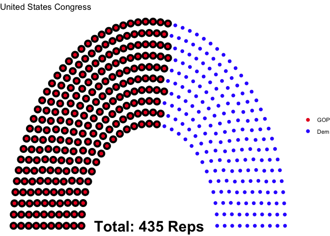
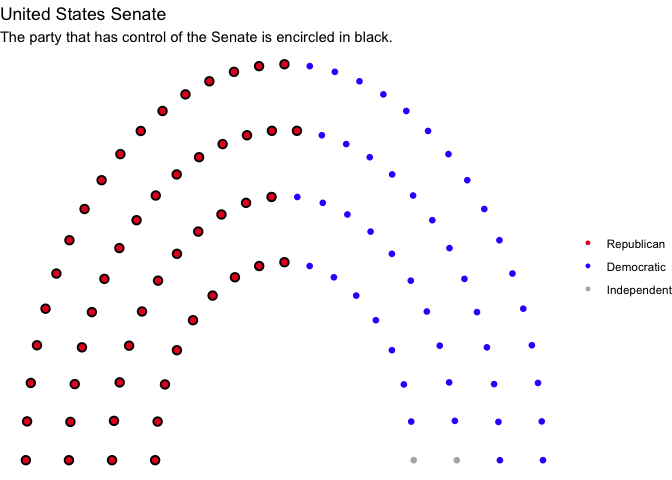
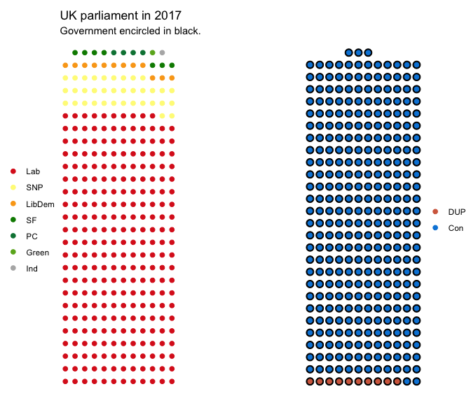
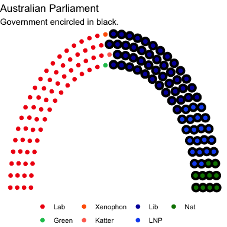
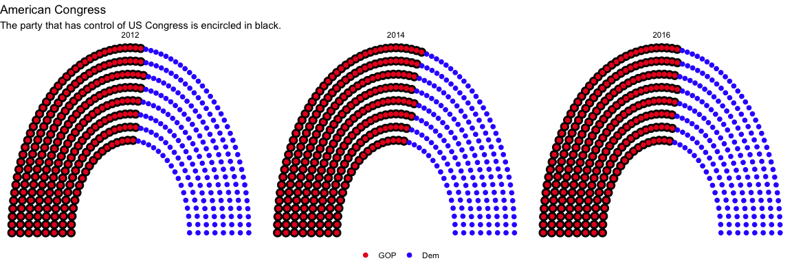
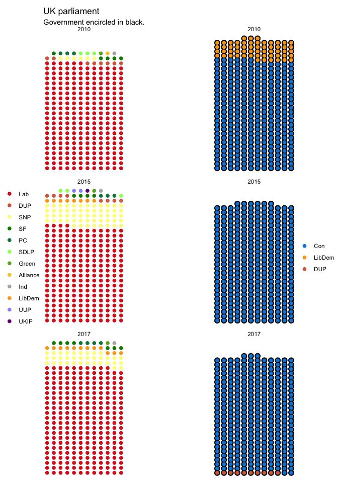
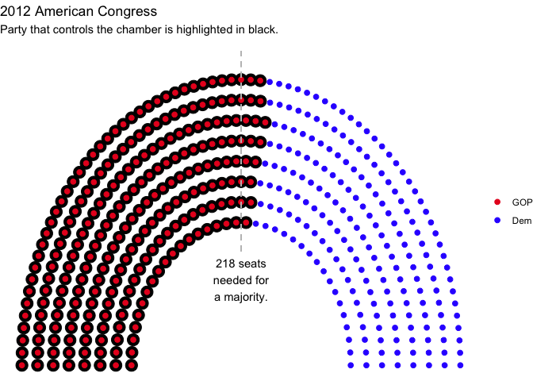
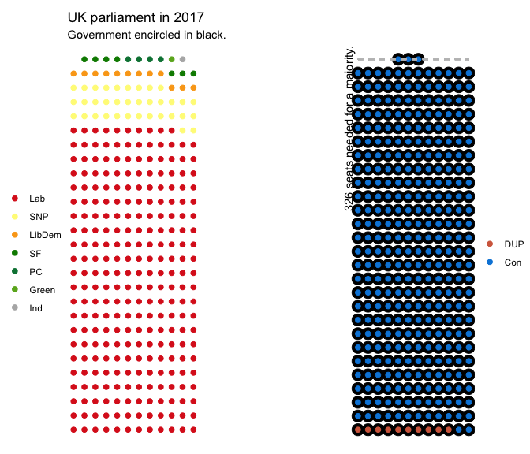
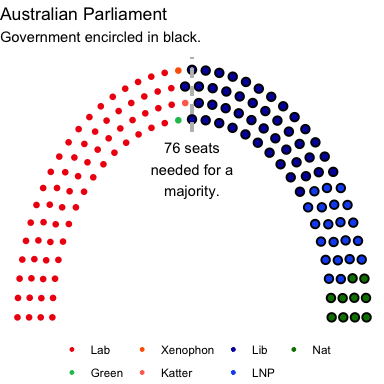
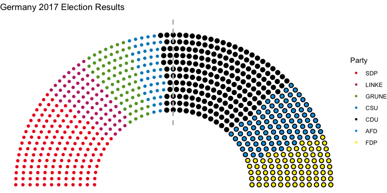

# Parliament plots

This package attempts to implement "parliament plots" - visual representations of the composition of legislatures that display seats colour-coded by party. The input is a data frame containing one row per party, with columns representing party name/label and number of seats, respectively.

This `R` package is a `ggplot2` extension.

To install the package:

```r
devtools::install_github("robwhickman/ggparliament")
```

Inspiration from this package comes from: [parliamentdiagram](https://github.com/slashme/parliamentdiagram), which
is used on Wikipedia, [parliament-svg](https://github.com/juliuste/parliament-svg), which is a
javascript clone, and [a discussion on StackOverflow](http://stackoverflow.com/questions/42729174/creating-a-half-donut-or-parliamentary-seating-chart), which provided some of the code for part for the "arc" representations used in this package.

Unique parliament layouts:
==========================

[This is a *Washington Post* article on parliament layouts.](https://www.washingtonpost.com/news/monkey-cage/wp/2017/03/04/these-5-designs-influence-every-legislature-in-the-world-and-tell-you-how-each-governs/?utm_term=.e1e1c1c3c37b)
It is a pretty useful reference.


## Semicircle parliament

### EU, France, United States, and so on...


### Plot of US Congress


```r
us_congress <- election_data %>%
  filter(country == "USA" &
    year == 2016 &
    house == "Representatives")

us_congress1 <- parliament_data(election_data = us_congress,
  type = "semicircle",
  total_seats = sum(us_congress$seats),
  parl_rows = 10,
  party_names = us_congress$party_short,
  party_seats = us_congress$seats)

us_senate <- election_data %>%
  filter(country == "USA" &
    year == 2016 &
    house == "Senate")


us_senate <- parliament_data(
  election_data = us_senate,
  type = "semicircle",
  total_seats = sum(us_senate$seats),
  parl_rows = 4,
  party_names = us_senate$party_short,
  party_seats = us_senate$seats)
```


```r
ggplot(us_congress1, aes(x, 
                         y, 
                         colour = party_short)) +
  geom_parliament_seats() + 
  geom_highlight_government(government == 1) +
  theme_void() +
  labs(colour = NULL, 
       title = "United States Congress") +
  annotate("text", x=0, y=0, 
           label=paste("Total:", sum(us_congress$seats), "Reps"), fontface="bold", size=8) +
  scale_colour_manual(values = us_congress1$colour, 
                      limits = us_congress1$party_short)
```

<!-- -->

### Plot of US Senate


```r
senate <- ggplot(us_senate, aes(x, 
                                y, 
                                colour = party_long)) +
  geom_parliament_seats() + 
  geom_highlight_government(government == 1) +
  theme_void() +
  labs(colour = NULL, 
       title = "United States Senate",
       subtitle = "The party that has control of the Senate is encircled in black.") +
  scale_colour_manual(values = us_senate$colour,
                      limits = us_senate$party_long)
senate 
```

<!-- -->


### Plot of German Bundestag


```r
germany <- election_data %>%
  filter(year == 2017 & 
           country == "Germany") 

germany <- parliament_data(election_data = germany, 
                           total_seats = sum(germany$seats), 
                           parl_rows = 10,
                           party_seats = germany$seats, 
                           type = 'semicircle')

ger <- ggplot(germany, aes(x,
                    y,
                    colour = party_short))+
  geom_parliament_seats()+
  geom_highlight_government(government == 1) + 
  labs(colour="Party", 
       title="Germany 2017 Election Results") + 
  theme_void()+
  scale_colour_manual(values = germany$colour, 
                      limits = germany$party_short)
```

## Opposing Benches Parliament

### United Kingdom


```r
#data preparation
uk_17 <- election_data %>% 
  filter(country == "UK" & 
           year == "2017")


uk_17_left <- uk_17 %>% 
  filter(government == 0)
uk_17_right <- uk_17 %>% 
  filter(government == 1)


uk_17_left <- parliament_data(election_data = uk_17_left,
  total_seats = sum(uk_17_left$seats),
  party_seats =  uk_17_left$seats,
  parl_rows = 12,
  type = "opposing_benches")


uk_17_right <- parliament_data(election_data = uk_17_right,
  total_seats = sum(uk_17_right$seats),
  party_seats = uk_17_right$seats,
  parl_rows = 12,
  type = "opposing_benches")

right <- ggplot(uk_17_right, aes(x, 
                                 y, 
                                 colour = party_short)) +
  geom_parliament_seats() + 
  geom_highlight_government(government==1) + 
  theme_void() +
  labs(colour = NULL) +
  scale_colour_manual(values = uk_17_right$colour, 
                      limits = uk_17_right$party_short) +
  theme(legend.position = 'right')


left <- ggplot(uk_17_left, aes(x, 
                               y, 
                               colour = party_short)) +
  geom_parliament_seats() + 
  theme_void() +
  labs(colour = NULL, 
       title = "UK parliament in 2017",
       subtitle="Government encircled in black.") +
  scale_colour_manual(values = uk_17_left$colour, 
                      limits = uk_17_left$party_short) +
  theme(legend.position = 'left') 

uk_parliament<- combine_opposingbenches(left = left, 
                                        right = right)
uk_parliament
```

<!-- -->


## Horseshoe parliament

### Australia, New Zealand


```r
australia <- election_data %>%
  filter(country == "Australia" &
    house == "Representatives" &
    year == 2016) 

australia1 <- parliament_data(election_data = australia,
  total_seats = sum(australia$seats),
  party_seats = australia$seats,
  parl_rows = 4,
  type = "horseshoe")
```

### Plot of Australian parliament


```r
au <-ggplot(australia1, aes(x, 
                            y, 
                            colour = party_short)) +
  geom_parliament_seats() + 
  theme_void() +
  geom_highlight_government(government == 1) + 
  labs(colour = NULL, 
       title = "Australian Parliament",
       subtitle = "Government encircled in black.") +
  scale_colour_manual(values = australia$colour, 
                      limits = australia$party_short) + 
  theme(legend.position = 'bottom') 
au
```

<!-- -->


# Faceting the data
 

If you want to facet a parliament, you can use a split-apply-combine strategy in a `dplyr` chain.

## Steps
You must:

1) split by year
2) apply the coordinates for each party
3) combine the rows into one large data frame.

A few examples are as follows:

### American Congress from 2010 onwards

```r
usa <- election_data %>%
  filter(country == "USA" &
    house == "Representatives")  %>% 
  split(.$year) %>% # split
  map(~parliament_data(election_data = ., # apply
  total_seats = sum(.$seats),
  party_seats = .$seats,
  parl_rows = 8,
  type = "semicircle")) %>%
  bind_rows() # combine
```


```r
ggplot(usa, aes(x, 
                y, 
                colour = party_short)) +
  geom_parliament_seats() + 
  geom_highlight_government(government == 1) + 
  labs(colour = NULL, 
       title = "American Congress",
       subtitle = "The party that has control of US Congress is encircled in black.") +
  theme_void() +
  scale_colour_manual(values = usa$colour, 
                      limits = usa$party_short) + 
  theme(legend.position = 'bottom') + 
  facet_grid(~year, scales = 'free') 
```

<!-- -->


### Facet Australian Parliament by House

```r
australia <- election_data %>%
  filter(country == "Australia" &
    year == "2016")  %>% 
  split(.$house) %>% # split
  map(~parliament_data(election_data = ., # apply
  total_seats = sum(.$seats),
  party_seats = .$seats,
  parl_rows = 4,
  type = "horseshoe")) %>%
  bind_rows() # combine
```


```r
ggplot(australia, aes(x, 
                      y, 
                      colour=party_short)) +
  geom_parliament_seats() + 
  geom_highlight_government(government == 1) + 
  labs(colour = NULL, 
       title = "Australian Parliament",
       subtitle = "Government encircled in black.") +
  scale_colour_manual(values = australia$colour, 
                      limits = australia$party_short) + 
  theme_void() +
  theme(legend.position = 'bottom') + 
  facet_grid(~house, scales = 'free')
```

<!-- -->

### Facet UK Parliament


```r
uk_left<- election_data %>%
  filter(country == "UK" & 
           government == 0)  %>%
  split(.$year) %>%
  map(~parliament_data(election_data = .,
  total_seats = sum(.$seats),
  party_seats = .$seats,
  parl_rows = 12,
  type = "opposing_benches")) %>%
  bind_rows()

uk_right<-election_data %>%
  filter(country == "UK" & 
           government == 1)  %>%
  split(.$year) %>%
  map(~parliament_data(election_data = .,
  total_seats = sum(.$seats),
  party_seats = .$seats,
  parl_rows = 12,
  type = "opposing_benches")) %>%
  bind_rows()
```


```r
right_all <- ggplot(uk_right, aes(x, 
                                  y, 
                                  colour = party_short)) +
  geom_parliament_seats() + 
  geom_highlight_government(government == 1) + 
  theme_void() +
  labs(colour = NULL) +
  scale_colour_manual(values = uk_right$colour, 
                      limits = uk_right$party_short) +
  theme(legend.position = 'right')+
  facet_wrap(~year, ncol = 1)


left_all <- ggplot(uk_left, aes(x, 
                                y, 
                                colour = party_short)) +
  geom_parliament_seats() + 
  theme_void() +
  labs(colour = NULL, 
       title = "UK parliament",
       subtitle="Government encircled in black.") +
  scale_colour_manual(values = uk_left$colour, 
                      limits = uk_left$party_short) +
  theme(legend.position = 'left') +
  facet_wrap(~year, ncol = 1)

uk_parliament_10_15_17 <- combine_opposingbenches(left = left_all, 
                                                  right = right_all)
uk_parliament_10_15_17
```

<!-- -->

# Majority line

I have added a function called `draw_majoritythreshold()`. The user needs to define the number of seats that equals a majority and specify the type of parliament. Right now, we have 'horseshoe', 'semicircle', and 'opposing_benches' as options. The function plots a line through the majority seat from the outtermost row to the inner row. It also adds an annotation noting the seats required for a government to form. 

An example is as follows:


```r
usa_12 <- election_data %>%
  filter(country == "USA" &
    house == "Representatives" & 
      year == "2012")  %>% 
  parliament_data(election_data = .,
  total_seats = sum(.$seats),
  party_seats = .$seats,
  parl_rows = 8,
  type = "semicircle")
ggplot(usa_12, aes(x, 
                   y, 
                   colour = party_short)) +
  geom_parliament_seats() + 
  geom_highlight_government(government == 1) + 
  draw_majoritythreshold(n = 218,
                         type = "semicircle") + 
  theme_void() +
  labs(colour = NULL, 
       title = "2012 American Congress",
       subtitle = "Party that controls the chamber is highlighted in black.") +
  scale_colour_manual(values = usa_12$colour, 
                      limits = usa_12$party_short) + 
  theme(legend.position = 'right') 
```

<!-- -->


```r
# redraw the right hand side for the UK with draw_majoritythreshold()
right_new <- ggplot(uk_17_right, aes(x, 
                                     y, 
                                     colour = party_short)) +
  geom_parliament_seats() + 
  geom_highlight_government(government == 1) + 
  draw_majoritythreshold(n = 326,
                         type = 'opposing_benches') + 
  theme_void() +
  labs(colour = NULL) +
  scale_colour_manual(values = uk_17_right$colour, 
                      limits = uk_17_right$party_short) +
  theme(legend.position = 'right')

# combine
uk_parliament<- combine_opposingbenches(left = left, 
                                        right = right_new)
uk_parliament
```

<!-- -->


```r
australia <- election_data %>%
  filter(country == "Australia" &
    house == "Representatives" &
    year == 2016) 

australia1 <- parliament_data(election_data = australia,
  total_seats = sum(australia$seats),
  party_seats = australia$seats,
  parl_rows = 4,
  type = "horseshoe")

au <-ggplot(australia1, aes(x, 
                            y, 
                            colour = party_short)) +
  geom_parliament_seats() + 
  geom_highlight_government(government == 1) + 
  draw_majoritythreshold(n = 76,
                         type = 'horseshoe') + 
  theme_void() +
  labs(colour = NULL, 
       title = "Australian Parliament",
       subtitle = "Government encircled in black.") +
  scale_colour_manual(values = australia$colour, 
                      limits = australia$party_short) + 
  theme(legend.position = 'bottom') 
au
```

<!-- -->


```r
germany <- election_data %>%
  filter(year == 2017 & 
           country == "Germany") 

germany <- parliament_data(election_data = germany, 
                           total_seats = sum(germany$seats), 
                           parl_rows = 10,
                           party_seats = germany$seats, 
                           type = 'semicircle')

german_parliament <- ggplot(germany, aes(x,
                    y,
                    colour = party_short))+
  geom_parliament_seats()+
  geom_highlight_government(government == 1) + 
  draw_majoritythreshold(n = 355,
                         type = 'semicircle') +
  labs(colour="Party", 
       title="Germany 2017 Election Results") + 
  theme_void()+
  scale_colour_manual(values = germany$colour, 
                      limits = germany$party_short)
german_parliament
```

<!-- -->

# TODO

## Women in parliament

`geom_women_in_parliament()` now exists. When the user defines women MPs in the plot, the alpha on other MPs is set to 0.5, bringing women to the forefront.

## Electoral quotas

`geom_electoral_quota()` has been created. It plots an X on top of the original point. I think we can think of more creative things to do here... I wonder if there are any data that show whether someone was elected through a quota or through the "regular" process.

**Note**: `geom_women_in_parliament()` and `geom_electoral_quota()` have not yet been incorporated into `parliament_data()`. I think the best way to do that is to include aggregate data on women as well as those elected through a quota process as two new variables, and then expand that number to a long logical variable. i.e. if the Australian Labor Party has 48 female MPs in the House of Representatives in 2016, that column will expand into 48 1s and 0 for the remainder.


## Labels

* This also needs work

* Happy to take a look at your previous code, Rob, and add back into this branch.

## Facets

* I think we should bring in the old code that you wrote in the legacy branch. I really like the idea of shrinking the smaller house. 

## Other styles

* Bars -- maybe useful for plotting potential coalitions. 
* Rose?
* Pie?
* Geo_facet?
