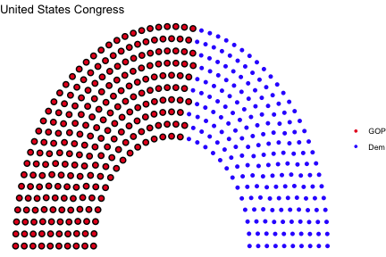
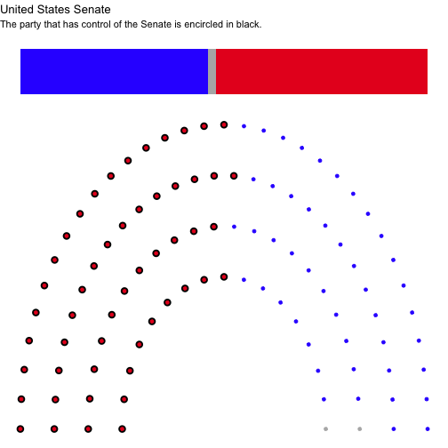
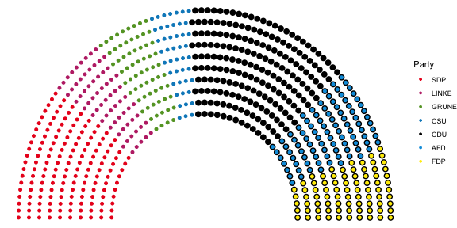
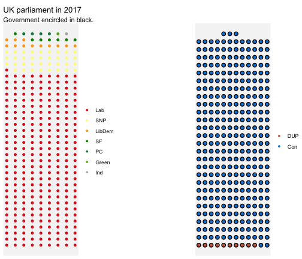
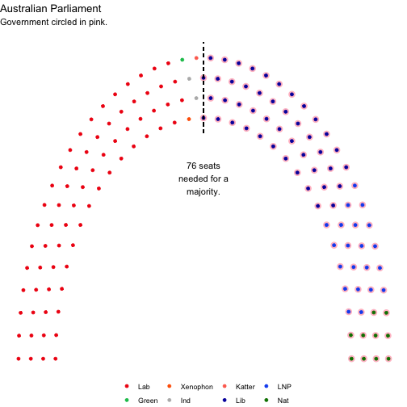

<!-- README.md is generated from README.Rmd. Please edit that file -->


# ggparliament 

# Parliament plots


This package attempts to implement "parliament plots" - visual representations of the composition of legislatures that display seats colour-coded by party. The input is a data frame containing one row per party, with columns representing party name/label and number of seats, respectively.

This `R` package is a `ggplot2` extension.

To install the package:

```r
devtools::install_github("robwhickman/ggparliament")
```

Inspiration from this package comes from: [parliamentdiagram](https://github.com/slashme/parliamentdiagram), which
is used on Wikipedia, [parliament-svg](https://github.com/juliuste/parliament-svg), which is a javascript clone, and [a discussion on StackOverflow](http://stackoverflow.com/questions/42729174/creating-a-half-donut-or-parliamentary-seating-chart), which provided some of the code for part for the "arc" representations used in this package.

## Semicircle parliament

### EU, France, United States, and so on...


### Plot of US Congress


```r
us_congress <- election_data %>%
  filter(country == "USA" &
    year == 2016 &
    house == "Representatives")

us_congress1 <- parliament_data(election_data = us_congress,
  type = "semicircle",
  total_seats = sum(us_congress$seats),
  parl_rows = 10,
  party_names = us_congress$party_short,
  party_seats = us_congress$seats)

us_senate <- election_data %>%
  filter(country == "USA" &
    year == 2016 &
    house == "Senate")


us_senate <- parliament_data(
  election_data = us_senate,
  type = "semicircle",
  total_seats = sum(us_senate$seats),
  parl_rows = 4,
  party_names = us_senate$party_short,
  party_seats = us_senate$seats)
```


```r
ggplot(us_congress1, aes(x, 
                         y, 
                         colour = party_short)) +
  geom_parliament_seats() + 
  geom_highlight_government(government == 1) +
  theme_void() +
  labs(colour = NULL, 
       title = "United States Congress") +
  scale_colour_manual(values = us_congress1$colour, 
                      limits = us_congress1$party_short) 
```



### Plot of US Senate


```r
senate <- ggplot(us_senate, aes(x, 
                                y, 
                                colour = party_long)) +
  geom_parliament_seats() + 
  geom_highlight_government(government == 1) +
  theme_void() +
  labs(colour = NULL, 
       title = "United States Senate",
       subtitle = "The party that has control of the Senate is encircled in black.") +
  scale_colour_manual(values = us_senate$colour,
                      limits = us_senate$party_long)
senate 
```




### Plot of German Bundestag


```r
germany <- election_data %>%
  filter(year == 2017 & 
           country == "Germany") 

germany <- parliament_data(election_data = germany, 
                           total_seats = sum(germany$seats), 
                           parl_rows = 10,
                           party_seats = germany$seats, 
                           type = 'semicircle')

ggplot(germany, aes(x,
                    y,
                    colour = party_short))+
  geom_parliament_seats()+
  geom_highlight_government(government == 1) + 
  labs(colour="Party", 
       title="Germany 2017 Election Results") + 
  theme_void()+
  scale_colour_manual(values = germany$colour, 
                      limits = germany$party_short) 
```



## Opposing Benches Parliament

### United Kingdom


```r
#data preparation
uk_17 <- election_data %>% 
  filter(country == "UK" & 
           year == "2017")


uk_17_left <- uk_17 %>% 
  filter(government == 0)
uk_17_right <- uk_17 %>% 
  filter(government == 1)


uk_17_left <- parliament_data(election_data = uk_17_left,
  total_seats = sum(uk_17_left$seats),
  party_seats =  uk_17_left$seats,
  parl_rows = 12,
  type = "opposing_benches")


uk_17_right <- parliament_data(election_data = uk_17_right,
  total_seats = sum(uk_17_right$seats),
  party_seats = uk_17_right$seats,
  parl_rows = 12,
  type = "opposing_benches")

right <- ggplot(uk_17_right, aes(x, 
                                 y, 
                                 colour = party_short)) +
  geom_parliament_seats() + 
  geom_highlight_government(government==1) + 
  theme_void() +
  labs(colour = NULL) +
  scale_colour_manual(values = uk_17_right$colour, 
                      limits = uk_17_right$party_short) +
  theme(legend.position = 'right')


left <- ggplot(uk_17_left, aes(x, 
                               y, 
                               colour = party_short)) +
  geom_parliament_seats() + 
  theme_void() +
  labs(colour = NULL, 
       title = "UK parliament in 2017",
       subtitle="Government encircled in black.") +
  scale_colour_manual(values = uk_17_left$colour, 
                      limits = uk_17_left$party_short) +
  theme(legend.position = 'left') 

uk_parliament<- combine_opposingbenches(left = left, 
                                        right = right)
uk_parliament
```




## Horseshoe parliament

### Australia, New Zealand


```r
australia <- election_data %>%
  filter(country == "Australia" &
    house == "Representatives" &
    year == 2016) 

australia1 <- parliament_data(election_data = australia,
  total_seats = sum(australia$seats),
  party_seats = australia$seats,
  parl_rows = 4,
  type = "horseshoe")
```

### Plot of Australian parliament


```r
au <-ggplot(australia1, aes(x, 
                            y, 
                            colour = party_short)) +
  geom_parliament_seats() + 
  theme_void() +
  geom_highlight_government(government == 1) + 
  labs(colour = NULL, 
       title = "Australian Parliament",
       subtitle = "Government encircled in black.") +
  scale_colour_manual(values = australia$colour, 
                      limits = australia$party_short) + 
  theme(legend.position = 'bottom') 
au
```




