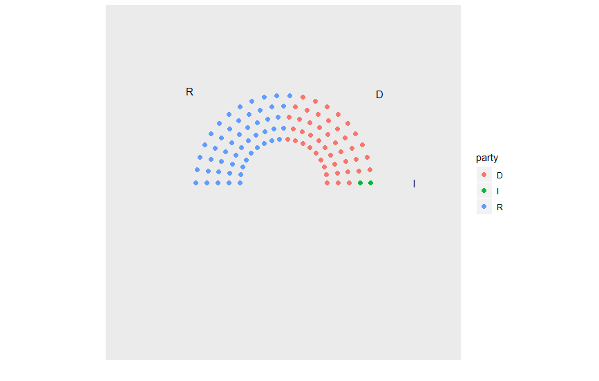
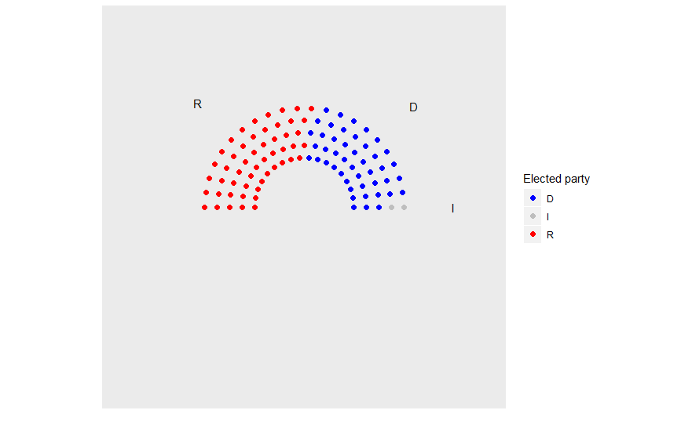
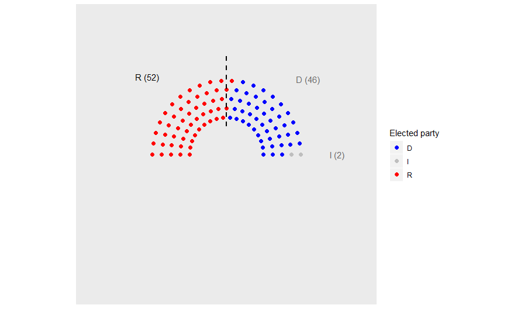
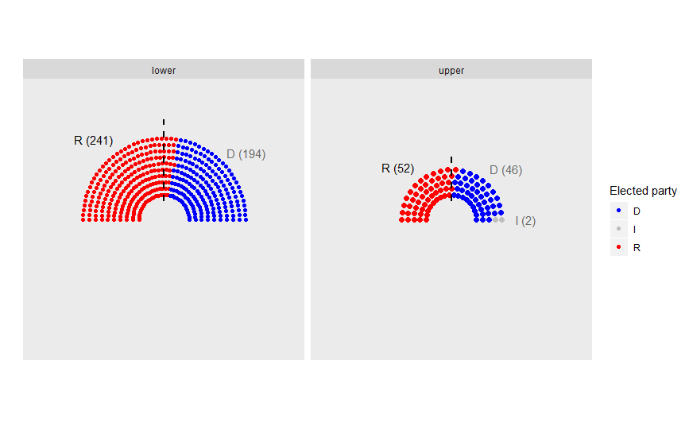

# Parliament plots

This package attempts to implement "parliament plots" - visual representations of the composition of legislatures that display seats color-coded by party. The input is a data frame containing one row per party, with columns representing party name/label and number of seats, respectively.

Inspiration from this package comes from: [parliamentdiagram](https://github.com/slashme/parliamentdiagram), which is used on Wikipedia, [parliament-svg](https://github.com/juliuste/parliament-svg), which is a javascript clone, and [a discussion on StackOverflow](http://stackoverflow.com/questions/42729174/creating-a-half-donut-or-parliamentary-seating-chart), which provided some of the code for part for the "arc" representations used in this package.

```{r}
library(ggplot2)
library(ggparliament)

#first lets load the attached data on US congressional elections
data <- US_congress

#lets start with just the latest senate results
data <- data[which(data$congress == 115 & data$chamber == "upper"),]

#lets plot these results
p <- ggparl_dots(data = data, party = "party_short", seats1 = "seats",
                 #aesthetics for the plot
                 style = c("dots"), portion = 0.5, nrows = 5, size = 2,
                 #label the parties by their name
                 label = c("name"))
```



```{r}
#add colour data for the parties to make the chart intelligible
col_data <- data.frame(party = c("Democrats", "Republicans", "Other"),
                       colour = c("Blue", "Red", "Grey"))
data <- merge(data, col_data, by = "party")

#add this to the plot
p <- ggparl_dots(data = data, party = "party_short", seats1 = "seats",
                 style = c("dots"), portion = 0.5, nrows = 5, size = 2,
                 label = c("name"), colour = "colour")
```



```{r}
#a party needs >50% of the seats for control of the senate
p <- ggparl_dots(data = data, party = "party_short", seats1 = "seats",
                 style = c("dots"), portion = 0.5, nrows = 5, size = 2,
                 label = c("both"), colour = "colour", segment = 0.5)
```


```{r}
#republicans clearly have control of the senate, lets make this explicit in the graph
control_data <- data.frame(party = c("Democrats", "Republicans", "Other"),
                           control = c(NA, 1, NA))
data <- merge(data, control_data, by = "party")

p <- ggparl_dots(data = data, party = "party_short", seats1 = "seats",
                 style = c("dots"), portion = 0.5, nrows = 5, size = 2,
                 label = c("both"), colour = "colour", segment = 0.5, government = "control")
```



```{r}
#More experimental stuff- autoscaling of plots
#lets take the data on both houses from the most recent elections
data <- US_congress
data <- data[which(data$congress == 115),]
col_data <- data.frame(party = c("Democrats", "Republicans", "Other"),
                       colour = c("Blue", "Red", "Grey"))
data <- merge(data, col_data, by = "party")
#republicans control both houses which makes this a bit easier
control_data <- data.frame(party = c("Democrats", "Republicans", "Other"),
                           control = c(NA, 1, NA))
data <- merge(data, control_data, by = "party")

p <- ggparl_dots(data = data, party = "party_short", seats1 = "seats",
                 style = c("dots"), portion = 0.5, nrows = 5, size = 2,
                 label = c("both"), colour = "colour", segment = 0.5, government = "control", group = "chamber",
                 autoscale = "yes")

```


