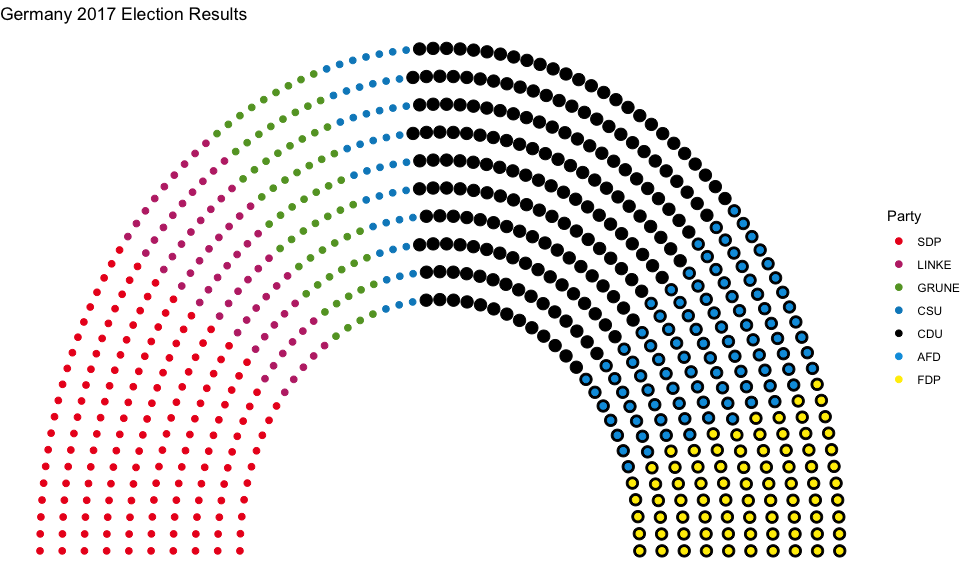
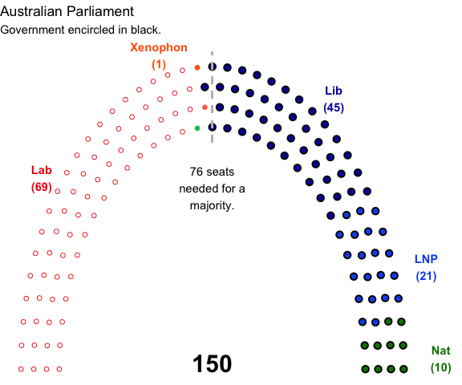
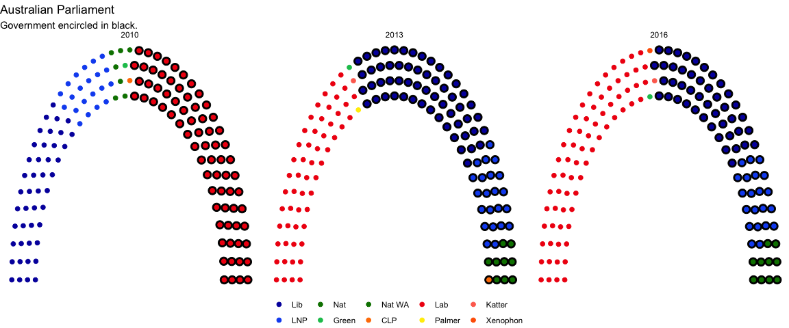

# Parliament plots

This package attempts to implement "parliament plots" - visual representations of the composition of legislatures that display seats color-coded by party. The input is a data frame containing one row per party, with columns representing party name/label and number of seats,
respectively.

To install the package:

```r
devtools::install_github("robwhickman/ggparliament")
```

Inspiration from this package comes from: [parliamentdiagram](https://github.com/slashme/parliamentdiagram), which
is used on Wikipedia, [parliament-svg](https://github.com/juliuste/parliament-svg), which is a
javascript clone, and [a discussion on StackOverflow](http://stackoverflow.com/questions/42729174/creating-a-half-donut-or-parliamentary-seating-chart), which provided some of the code for part for the "arc" representations used in this package.

Unique parliament layouts:
==========================

[This is a *Washington Post* article on parliament layouts.](https://www.washingtonpost.com/news/monkey-cage/wp/2017/03/04/these-5-designs-influence-every-legislature-in-the-world-and-tell-you-how-each-governs/?utm_term=.e1e1c1c3c37b)
It is a pretty useful reference.


## Semicircle parliament

### EU, France, United States, and so on...

#### Data


```r
us_congress <- election_data %>%
  filter(country == "USA" &
    year == "2016" &
    house == "Representatives")
us_congress1 <- parliament_data(election_data = us_congress,
  type = "semicircle",
  total_seats = sum(us_congress$seats),
  parl_rows = 10,
  party_names = us_congress$party_short,
  party_seats = us_congress$seats)
us_senate <- election_data %>%
  filter(country == "USA" &
    year == "2016" &
    house == "Senate")
us_senate <- parliament_data(
  election_data = us_senate,
  type = "semicircle",
  total_seats = sum(us_senate$seats),
  parl_rows = 4,
  party_names = us_senate$party_short,
  party_seats = us_senate$seats)
```

#### Plot of US Congress


```r
ggplot(us_congress1, aes(x, y, colour = party_short)) +
  geom_parliament_seats() + 
  geom_highlight_government(government == 1) +
  theme_void() +
  labs(colour = "", title = "United States Congress") +
  annotate("text", x=0, y=0, label=paste("Total:", sum(us_congress$seats), "Reps"), fontface="bold", size=8) +
  scale_colour_manual(values = us_congress1$colour, limits = us_congress1$party_short)
```

<!-- -->

#### Plot of US Senate


```r
senate <- ggplot(us_senate, aes(x=x, y=y, colour=party_long)) +
  geom_parliament_seats() + 
  geom_highlight_government(government == 1) +
  theme_void() +
  labs(colour = "", 
       title = "United States Senate",
       subtitle = "The party that has control of the Senate is encircled in black.") +
  scale_colour_manual(values = us_senate$colour, limits=us_senate$party_long)
senate 
```

<!-- -->


## Plot of German Bundestag


```r
germany <- election_data %>%
  filter(year==2017 & country=="Germany") %>%
  arrange(government)

germany <- parliament_data(election_data=germany, 
                           total_seats = sum(germany$seats), 
                           parl_rows=10,
                           party_seats=germany$seats, 
                           type='semicircle')

ggplot(germany, aes(x,y,colour=party_short))+
  geom_parliament_seats()+
  geom_highlight_government(government==1) + 
  labs(colour="Party", title="Germany 2017 Election Results") + 
  theme_void()+
  scale_colour_manual(values = germany$colour, limits=germany$party_short)
```

<!-- -->


## Horseshoe parliament

### Australia, New Zealand

#### Data


```r
australia <- election_data %>%
  filter(country == "Australia" &
    house == "Representatives" &
    year == "2016")  %>% 
  mutate(government = ifelse(is.na(government), 0, government)) %>% 
  arrange(government) 

australia <- parliament_data(election_data = australia,
  total_seats = sum(australia$seats),
  party_seats = australia$seats,
  parl_rows = 4,
  type = "horseshoe")
```

#### Plot of Australian parliament


```r
ggplot(australia, aes(x, y, color=party_short)) +
  geom_parliament_seats() + 
  theme_void() +
  geom_highlight_government(government==1) + 
  labs(colour = "", 
       title = "Australian Parliament",
       subtitle = "Government encircled in black.") +
  scale_colour_manual(values = australia$colour, 
                      limits = australia$party_short) + 
  theme(legend.position = 'bottom') 
```

<!-- -->


## Facet the data and plot 
 
### American Congress from 2010 onwards

If you want to facet Congress by each election year, you can use a split-apply-combine strategy in the dplyr chain.
You must:
1) split by year
2) apply the coordinates for each party per year
3) combine the rows into one large data frame.

An example is as follows:

```r
usa <- election_data %>%
  filter(country == "USA" &
    house == "Representatives")  %>% 
  mutate(government = ifelse(is.na(government), 0, government)) %>% 
  arrange(desc(party_short)) %>% 
  split(.$year) %>% # split
  map(~parliament_data(election_data = ., #apply
  total_seats = sum(.$seats),
  party_seats = .$seats,
  parl_rows = 8,
  type = "semicircle")) %>%
  bind_rows() # combine
```

#### Plot of US Congress By Year

```r
ggplot(usa, aes(x, y, color=party_short)) +
  geom_parliament_seats() + 
  theme_void() +
  geom_highlight_government(government==1) + 
  labs(colour = "", 
       title = "American Congress",
       subtitle = "The party that has control of US Congress is encircled in black.") +
  scale_colour_manual(values = usa$colour, 
                      limits = usa$party_short) + 
  theme(legend.position = 'bottom') + 
  facet_grid(~year, scales='free')
```

<!-- -->


#### Plot Australian Parliament By Year

```r
australia <- election_data %>%
  filter(country == "Australia" &
    house == "Representatives")  %>% 
  mutate(government = ifelse(is.na(government), 0, government)) %>% 
  arrange(government) %>% 
  split(.$year) %>%
  map(~parliament_data(election_data = .,
  total_seats = sum(.$seats),
  party_seats = .$seats,
  parl_rows = 4,
  type = "horseshoe")) %>%
  bind_rows()
```


```r
ggplot(australia, aes(x, y, color=party_short)) +
  geom_parliament_seats() + 
  theme_void() +
  geom_highlight_government(government==1) + 
  labs(colour = "", 
       title = "Australian Parliament",
       subtitle = "Government encircled in black.") +
  scale_colour_manual(values = australia$colour, 
                      limits = australia$party_short) + 
  theme(legend.position = 'bottom') + 
  facet_grid(~year, scales='free')
```

<!-- -->
